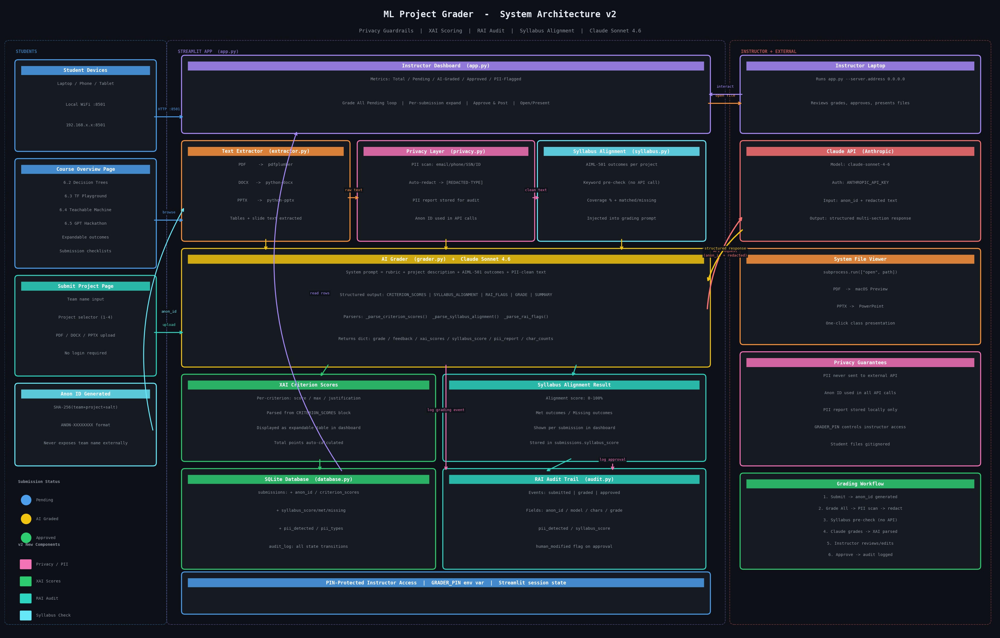

# ML Project Grader

An AI-assisted grading application for machine learning course projects, built around an agentic architecture with a human-in-the-loop approval layer. Instructors trigger an autonomous grading loop that dispatches each student submission to a Claude AI grading agent, receives structured assessments, and surfaces them for review before posting.



---

## Agentic Architecture

The system is designed around three cooperating agents and a shared state layer. No agent acts in isolation — each depends on outputs from the previous layer before proceeding.

```
┌─────────────────────────────────────────────────────────────────┐
│                        AGENT LAYER                              │
│                                                                 │
│  [Orchestrator Agent]  ──────────>  [Grading Agent]            │
│   Streamlit Dashboard               Claude Sonnet 4.6           │
│   - manages submission queue        - receives rubric + text    │
│   - dispatches grading tasks        - returns structured grade  │
│   - routes responses                - stateless per call        │
│                                                                 │
│                    [Human Agent]                                │
│                     Instructor                                  │
│                     - reviews AI draft                          │
│                     - edits or approves                         │
│                     - posts final grade                         │
└─────────────────────────────────────────────────────────────────┘
                              │
                    [Shared State Layer]
                     SQLite + File Storage
                     - submission records
                     - grade drafts
                     - approval status
```

### Agent Roles

| Agent | Implementation | Responsibility |
|---|---|---|
| **Orchestrator** | `app.py` + `database.py` | Manages the submission queue, sequences tool calls, dispatches tasks to the Grading Agent, routes responses back to the Human Agent |
| **Grading Agent** | `grader.py` + Claude API | Stateless reasoning agent — receives a fully-formed task context and returns a structured assessment. One invocation per submission |
| **Human Agent** | Instructor via dashboard | Final decision authority. Reviews AI output, edits if needed, and triggers grade posting. Cannot be bypassed |

---

## A2A Communication Protocols

### 1. Task Dispatch Protocol (Orchestrator → Grading Agent)

Before dispatching, the Orchestrator calls two tools in sequence to assemble the task context:

```
Step 1: extractor.extract_text(file_path)
        PDF / DOCX / PPTX  →  plain text string

Step 2: rubrics.PROJECTS[n]['rubric']
        Project number  →  rubric text

Step 3: grader.grade_submission(project_number, text, team_name)
        Assembled context  →  Claude API call
```

The task payload sent to the Grading Agent follows this structure:

```
SYSTEM:
  [Project description]
  [Full rubric text with criteria and point values]
  [Output format specification]

USER:
  Team: {team_name}
  Submission: {extracted_text[:15000]}
```

The system prompt is fully deterministic — identical rubric text is injected for every submission of the same project, ensuring consistent evaluation standards across the batch.

### 2. Response Protocol (Grading Agent → Orchestrator)

The Grading Agent returns a structured plain-text response using a rigid section format. The Orchestrator parses this response to extract the grade token and store the full feedback:

```
GRADE: B+

SUMMARY:
[2-3 sentence overall assessment]

RUBRIC BREAKDOWN:
[Per-criterion scores and specific feedback]

STRENGTHS:
[2-3 specific observations from the submission]

AREAS FOR IMPROVEMENT:
[2-3 actionable suggestions]
```

The Orchestrator scans for the `GRADE:` prefix to extract the grade token, then writes both the grade and full response body to the database with `status = 'ai_graded'`.

### 3. State Synchronization Protocol (Shared Memory)

SQLite acts as the message bus between agent interactions. Every state transition is a database write:

```
pending      →  ai_graded    (Grading Agent response received)
ai_graded    →  approved     (Human Agent approves)
```

The Orchestrator polls this state on every dashboard render. The Human Agent reads `ai_grade` / `ai_feedback`, writes `final_grade` / `final_feedback`, and sets `status = 'approved'`. The Grading Agent never reads from the database — it is fully stateless.

```
submissions table
─────────────────────────────────────────────────────
id | team_name | project_number | file_path | status
ai_grade | ai_feedback | final_grade | final_feedback
submitted_at | approved_at
```

### 4. Agentic Loop (Batch Grading)

The "Grade All Pending" button triggers an autonomous loop — the Orchestrator iterates over all `status = 'pending'` submissions and dispatches each one to the Grading Agent sequentially:

```python
for submission in pending_submissions:
    text    = extractor.extract_text(submission['file_path'])   # tool call
    rubric  = rubrics.PROJECTS[submission['project_number']]    # tool call
    grade, feedback = grader.grade_submission(...)              # agent call
    db.save_ai_grade(submission['id'], grade, feedback)         # state write
```

The loop is synchronous and observable — a progress bar reports each dispatch in real time. The Human Agent reviews all outputs after the loop completes.

### 5. Human-in-the-Loop Gate

The system enforces a mandatory human approval step before any grade is posted. The Grading Agent's output is always written with `status = 'ai_graded'` — never `'approved'`. Approval requires an explicit action from the Human Agent (the instructor clicking "Approve & Post Grade"). This gate exists at the database write level, not just the UI level.

```
Grading Agent output  →  [HUMAN GATE]  →  Posted grade
                          instructor
                          must approve
```

---

## Projects Supported

| Project | Topic | Rubric | Max Points |
|---|---|---|---|
| 6.2 | Decision Tree Activity | Full rubric | 70 |
| 6.3 | Algorithm Olympics: TF Playground | Holistic | — |
| 6.4 | Transfer Learning: Teachable Machine | Holistic | — |
| 6.5 | GPT Hackathon: RAG Chatbot | Full rubric | 120 |

---

## Setup

**1. Install dependencies**
```bash
pip install -r requirements.txt
```

**2. Set environment variables**
```bash
export ANTHROPIC_API_KEY="your-key-here"
export GRADER_PIN="1234"          # instructor dashboard PIN
```

**3. Run**
```bash
streamlit run app.py --server.address 0.0.0.0
```

Students connect from their own devices on the same network:
```
http://[your-laptop-ip]:8501
```

---

## File Structure

```
ml-grader/
├── app.py            # Streamlit UI + Orchestrator Agent logic
├── grader.py         # Grading Agent (Claude API dispatch + response parsing)
├── extractor.py      # Text extraction tool (PDF / DOCX / PPTX)
├── rubrics.py        # Rubric store — injected into agent system prompts
├── database.py       # Shared state layer (SQLite)
├── overview.py       # Student-facing course overview page
├── architecture.png  # System architecture diagram
├── requirements.txt
└── data/
    ├── grader.db          # SQLite database (gitignored)
    └── submissions/       # Uploaded student files (gitignored)
```

---

## Tech Stack

- **UI / Orchestration** — [Streamlit](https://streamlit.io)
- **Grading Agent** — [Claude Sonnet 4.6](https://anthropic.com) via Anthropic Python SDK
- **Text Extraction** — pdfplumber, python-docx, python-pptx
- **State / Persistence** — SQLite, local filesystem
- **Platform** — macOS, Python 3.11+
